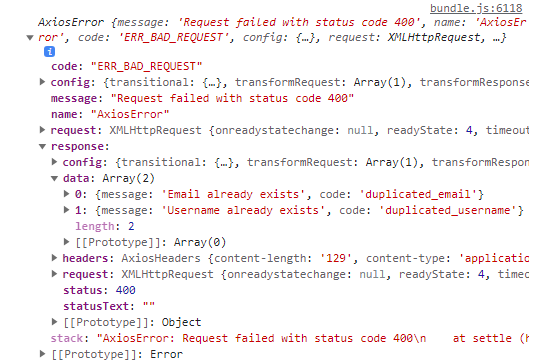

## 서버 에러 응답으로 에러 처리하기

토이프로젝트 회원가입시에 닉네임, 이메일이 중복되면 회원가입을 할 수 없게 만들었는데, 이때 에러 Status 코드 400과 함께 어떤 부분에서 문제가 있는지 response를 주었다. 이 response로 에러 처리를 진행해보았다.

### 에러코드가 어떻게 날라올까?

에러 코드가 어떻게 날라오는지 확인하기 위해 `input` 에 잘못된 정보를 넣고 서버로 요청을 보내 에러코드를 확인하기 위한 코드를 작성했다.

```JavaScript
try {
  // api call
} catch (err) {
  console.log(err);
  if (!err.response) {
    console.log("No server response");
  }
}
```

### 에러코드 확인하기



위의 사진은 `err` 객체를 찍어온 것인데, 내가 필요한 정보는 `data` 와 `status` 였다. `status` 로 if 문을 돌리고, `data` 객체 안에 있는 `code` 로 에러 처리를 진행해보려고 한다.

### data 객체에서 에러 걸러내기

여기서 내가 해야 할 것은

- `err.response.status` 가 400일때
  - duplicated email 처리
  - duplicated username 처리

이에 맞게 코드를 작성했다.

```JavaScript
try {
  // api call
} catch (err) {
  console.log(err);
  if (!err.response) {
    console.log("No server response");
  } else if (err.response.status === 400) {
    if (err.response.data.find(({ code }) => code === "duplicated_username")) {
      // 닉네임 중복 처리
    }
    if (err.response.data.find(({ code }) => code === "duplicated_email")) {
      // 이메일 중복 처리
    }
    // 다른 에러 처리
  }
}
```

data 객체 안에 있는 code를 검사하는 것으로 어떤 부분에 문제가 있는지 알 수 있기 때문에 각 상황에 맞는 에러 상태 처리를 할 수 있었다.
